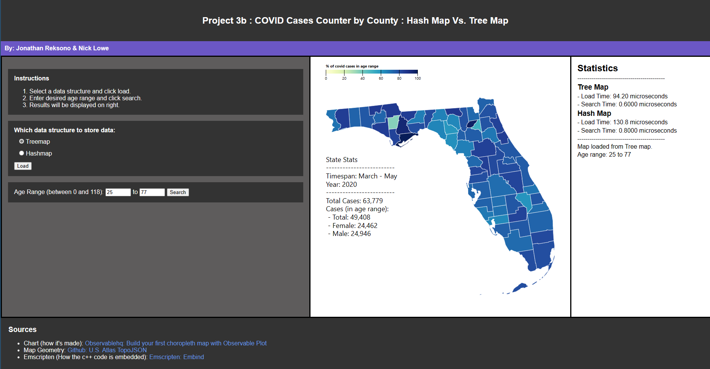

# COP3530Project3
---
 In this project, we compared by hash maps and tree maps by creating a web application that displays the covid cases from the March to May period of 2020.
 #### Tools used
 ----
- Languages: C++ and Javascript.
- Compiler: Emscripten (C++ into WebAssembly)
- Libraries: D3.js for Graph, http-server
- Other: Observablehq was used for the graph (My observable notebook for project: https://observablehq.com/d/68745bf3e80c591b)
#### Notes
---
The emscripten compiler code used in cpp_source folder. Compiled files were placed in root directory.
```
emcc --bind -O3 Treemap.cpp CovidHashMap.cpp -o Maps.js --preload-file data_files
```
### Sources 
--- 
Chart (how it's made):https://observablehq.com/@observablehq/build-your-first-choropleth-map-with-observable-plot
Map Geometry (For graph: loaded in the observable website): https://github.com/topojson/us-atlas
Emscripten (How the c++ code is embedded): https://emscripten.org/docs/porting/connecting_cpp_and_javascript/embind.html?highlight=embind
### Screenshot
---

